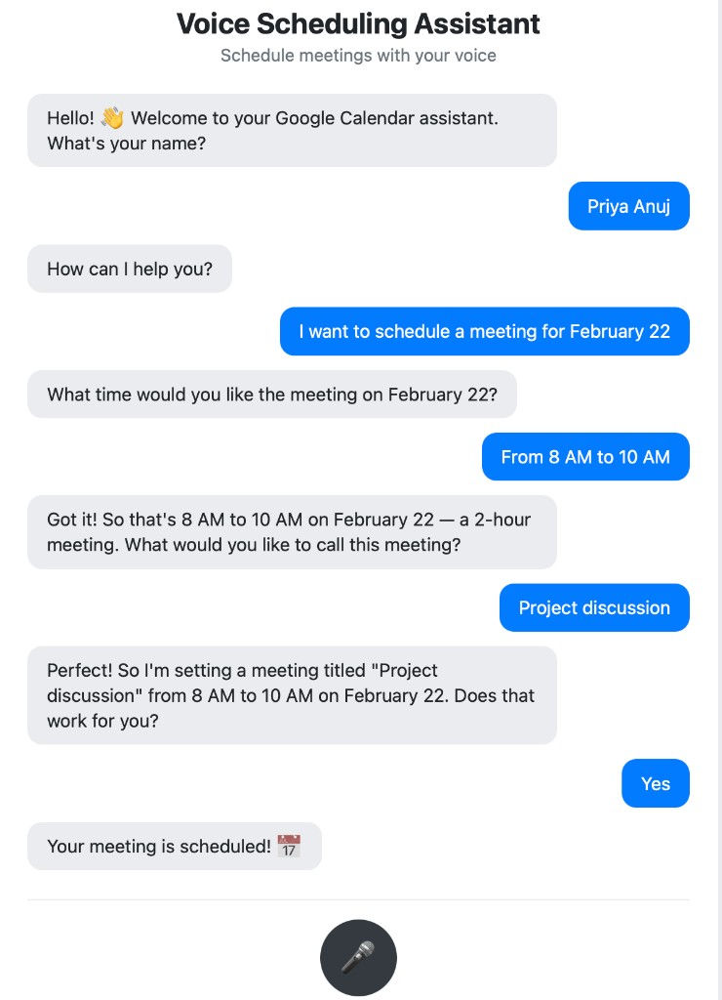
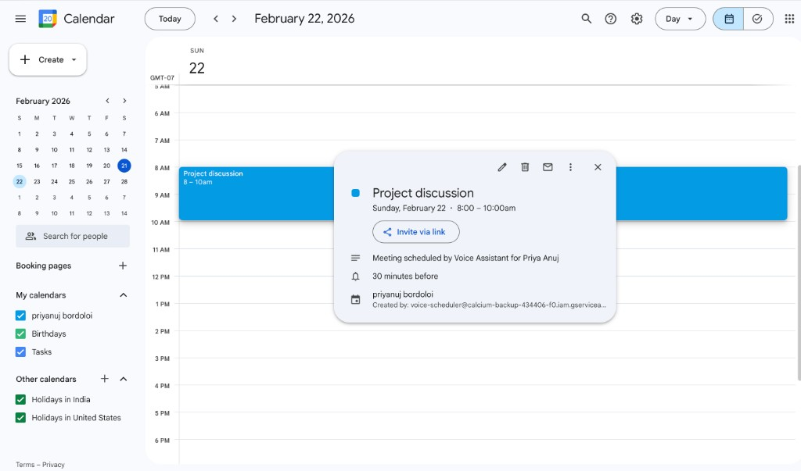
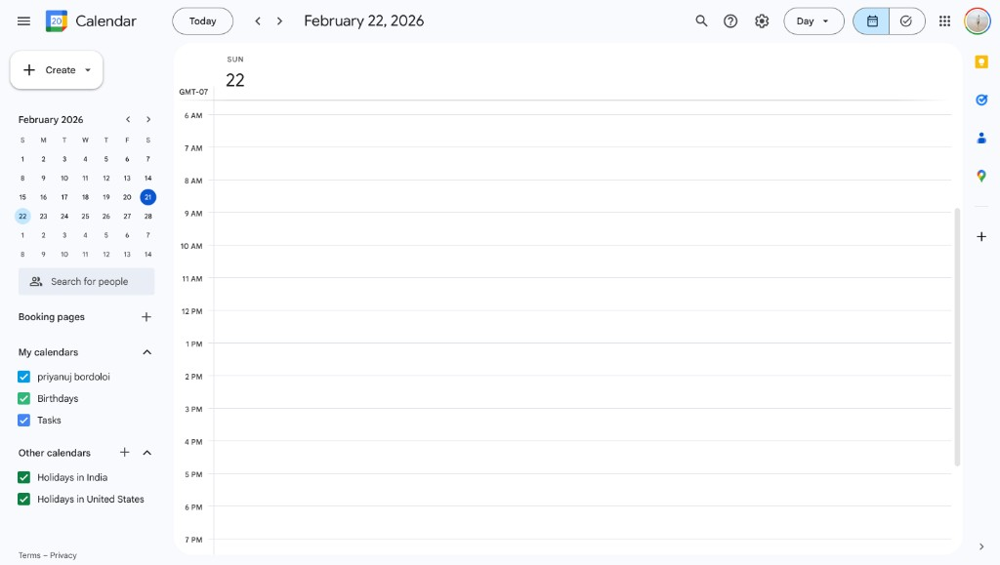

# Voice Scheduling Assistant

A real-time voice-powered scheduling agent that books Google Calendar events through natural conversation. Schedule **meetings** (with configurable duration) or **all-day events** (e.g. birthdays, anniversaries, festivals) by speaking in Chrome or Edge.

---

## Deployed URL and How to Test

### Live demo

**[Live app](https://voice-powered-google-calendar-scheduling-wzeg.onrender.com)** — Voice scheduling assistant (frontend + backend on Render).

- **Frontend:** [https://voice-powered-google-calendar-scheduling-wzeg.onrender.com](https://voice-powered-google-calendar-scheduling-wzeg.onrender.com)
- **Backend API:** [https://voice-powered-google-calendar-scheduling.onrender.com](https://voice-powered-google-calendar-scheduling.onrender.com) — used by the frontend; `API_URL` in `frontend/app.js` points here.

### How to test the agent

1. **Browser:** Use **Chrome** or **Edge** (Web Speech API required). Open the app URL.
2. **Microphone:** When prompted, allow microphone access so the assistant can hear you.
3. **First message:** You should hear/see: *"Hello! 👋 Welcome to your Google Calendar assistant. What's your name?"* Say your name (e.g. "I'm John").
4. **Second message:** The assistant replies: *"How can I help you?"* Say what you want:
   - **Meeting:** e.g. "I want to schedule a meeting" → you’ll be asked for date, time, duration (or default 30 min), and title. The assistant confirms the time range (e.g. "I am setting a meeting from 11 AM to 11:30. Is that okay?") before creating it.
   - **Event:** e.g. "Add a birthday" or "Add an event" → you’ll be asked for type, date, and optional title. Creates an all-day event.
5. **Confirmation:** After you confirm, the event is created and a "View on Google Calendar" link appears. You can also delete events by saying you want to remove/cancel one (you’ll be asked for date and title).

**Tips:** Speak clearly; if the assistant mishears, say the detail again. For times, say AM/PM (e.g. "11 AM") to avoid follow-up questions.

---

## Running locally (optional)

### Backend

```bash
cd backend
pip install -r requirements.txt
cp .env.example .env
```

Edit `backend/.env`:

- `ANTHROPIC_API_KEY` — Your Anthropic API key.
- `CALENDAR_ID` — Your Google Calendar ID (usually your Gmail address, or from Calendar settings).
- Optional: `TIMEZONE` (e.g. `America/Denver`, `Asia/Kolkata`).

Add Google credentials:

- Either place your **service account** JSON key as `backend/credentials.json`,  
- Or set `GOOGLE_CREDENTIALS_JSON` in `.env` to the full JSON string (for deployment).

Then start the server:

```bash
uvicorn server:app --reload
```

Backend runs at `http://localhost:8000`.

### Frontend

- **Option A:** Open `frontend/index.html` in Chrome (File → Open, or drag the file into the browser). In `frontend/app.js`, leave `API_URL` as `http://localhost:8000`.
- **Option B:** Serve the folder locally, e.g. `cd frontend && python3 -m http.server 8080`, then open `http://localhost:8080` in Chrome.

Use the same flow as above to test (name → "How can I help you?" → meeting or event).

---

## Calendar integration

The assistant talks to **Google Calendar** via the **Google Calendar API (v3)** using a **service account**.

### How it’s wired

1. **Credentials:** A Google Cloud **service account** with Calendar API enabled. The key is loaded from `backend/credentials.json` or from the `GOOGLE_CREDENTIALS_JSON` environment variable (e.g. on Render).
2. **Calendar:** Events are created on the calendar whose ID is in `CALENDAR_ID` (typically your primary calendar, e.g. `your.email@gmail.com`). The service account must have access to that calendar (share the calendar with the service account’s client email with “Make changes to events”).
3. **Two kinds of events:**
   - **Meetings (timed):** Start time + duration (default 30 minutes, or whatever you say). Stored as `dateTime` + `timeZone` in the API. Example: "Meeting at 11 AM for 1 hour" → 11:00–12:00.
   - **Events (all-day):** e.g. birthdays, anniversaries, festivals. Stored as a single `date` (all-day). No start/end time.
4. **Flow:** The LLM (Claude) drives the conversation and outputs a structured **SCHEDULE** block (meeting or event). The backend parses it and calls `calendar_service.create_event()` with either `start_datetime_str` + `duration_minutes` or `date` for all-day. The API returns an `htmlLink` that we show as "View on Google Calendar".
5. **Deleting:** You can say "remove/cancel that event"; the assistant asks for full date and title, then the backend finds a matching event on that day and deletes it via the same API.

### Relevant code

- **Backend:** [backend/server.py](backend/server.py) — parses SCHEDULE/DELETE blocks, calls calendar service.
- **Calendar:** [backend/calendar_service.py](backend/calendar_service.py) — builds Calendar API client, `create_event()` (timed vs all-day), `delete_event_by_date_and_title()`.

---

## Screenshots

The app works end-to-end: you speak to schedule a meeting, and the event appears on Google Calendar.

| Voice assistant chat flow | Google Calendar — event created |
|---------------------------|----------------------------------|
|  |  |

*Left:* Say your name, request a meeting (e.g. "February 22, 8 AM to 10 AM"), provide a title ("Project discussion"), and confirm. *Right:* The event appears on your calendar with description "Meeting scheduled by Voice Assistant".

**Calendar day view (before/context):**



---

## Logs and demo video

With the backend running locally, watch the terminal for `POST /api/chat`, `SCHEDULE block extracted`, and `Calendar event created successfully` to confirm an event was created.

### Backend logs for event creation

When the user schedules a meeting (e.g. "Interview on February 22 from 12 PM for 2 hours"), the backend logs look like this:

```
2026-02-21 00:26:34 [INFO] server: POST /api/chat received, message_count=11
2026-02-21 00:26:34 [INFO] server: Calling Anthropic API: model=claude-haiku-4-5-20251001, message_count=11
2026-02-21 00:26:35 [INFO] httpx: HTTP Request: POST https://api.anthropic.com/v1/messages "HTTP/1.1 200 OK"
2026-02-21 00:26:35 [INFO] server: Anthropic response: input_tokens=1259, output_tokens=37, response_length=113
2026-02-21 00:26:46 [INFO] server: POST /api/chat received, message_count=13
2026-02-21 00:26:46 [INFO] server: Calling Anthropic API: model=claude-haiku-4-5-20251001, message_count=13
2026-02-21 00:26:47 [INFO] server: Anthropic response: input_tokens=1302, output_tokens=55, response_length=149
2026-02-21 00:26:47 [INFO] server: SCHEDULE block extracted (meeting): name='John', datetime='2026-02-22T12:00:00', title='Interview', duration_minutes=120
2026-02-21 00:26:47 [INFO] calendar_service: create_event (timed) called: summary='Interview', start_datetime_str='2026-02-22T12:00:00', duration_minutes=120, timezone=America/Phoenix
2026-02-21 00:26:47 [INFO] calendar_service: Loading Google credentials from credentials.json
2026-02-21 00:26:48 [INFO] calendar_service: Calendar event created successfully: https://www.google.com/calendar/event?eid=...
2026-02-21 00:26:48 [INFO] server: POST /api/chat returning with event_created=true, event_link=https://www.google.com/calendar/event?eid=...
INFO:     127.0.0.1:57231 - "POST /api/chat HTTP/1.1" 200 OK
```


---

## Tech stack

- **Frontend:** Vanilla HTML/CSS/JS, Web Speech API (STT + TTS)
- **Backend:** Python, FastAPI
- **LLM:** Claude Haiku 4.5 (Anthropic API)
- **Calendar:** Google Calendar API (Service Account)
- **Hosting:** e.g. Render (backend), static host for frontend

## Architecture

```
┌─────────────────────────────────────────────────────────┐
│                    BROWSER (Frontend)                    │
│  User speaks → Web Speech API (STT) → text              │
│  text → POST /api/chat ──────────────────────┐           │
│  assistant reply ←───────────────────────────┘           │
│  reply → SpeechSynthesis (TTS) → audio                   │
└─────────────────────────────────────────────────────────┘
                          │
                          ▼
┌─────────────────────────────────────────────────────────┐
│                   BACKEND (FastAPI)                      │
│  /api/init  → initial greeting (exact first message)   │
│  /api/chat  → conversation + Claude                     │
│    → Parse SCHEDULE (meeting or event) or DELETE         │
│    → Google Calendar API: create timed or all-day event │
│    → Return reply + event link (if created)             │
└─────────────────────────────────────────────────────────┘
```

## Logging

- **Backend:** `server.py` and `calendar_service.py` use Python `logging` (INFO). Logs include `/api/chat`, SCHEDULE/DELETE parsing, and calendar create/delete results.
- **Frontend:** Open DevTools → Console for API requests, voice events, and reply previews.

## Browser support
Chrome or Edge required (Web Speech API).
